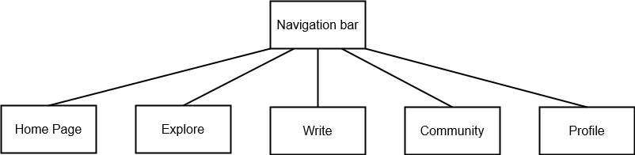

# Sitemap

## 1. Home Page

- **Trending Articles** (Top-performing blog posts)
- **Recently Published** (Chronologically latest posts)
- **Categories** (Blog categories like Travel, Lifestyle, Business)
- **Recommended for You** (Personalized based on reading history)
- **Community Highlights** (Popular writers, featured posts)

## 2. Explore (For Discovering Content)

- **Categories**
    - Examples: Travel, Lifestyle, Business, Food, DIY, Tech
- **Tags**
    - Examples: #SustainableLiving, #RemoteWork, #PlantBased, #DigitalMarketing
- **Top Writers** (Profiles of users with high engagement)
- **Popular Collections** (Curated collections by admin or community)
- **Search Bar** (Keyword search for blog posts and writers)
- **Trending Tags** (Popular hashtags or topics)

## 3. Write (Content Creation and Drafting)

- **New Post**
    - **Title & Content Editor** (Rich text editor with options for headings, images, and formatting)
    - **Add Tags** (For discoverability)
    - **Categories** (Assign categories for better organization)
    - **SEO Optimization Suggestions** (Hints to improve search engine visibility)
- **Saved Drafts** (List of unfinished blog posts)
- **Published Posts** (List of all user’s published posts with analytics)
- **Templates Library** (Quick access to pre-formatted templates)

## 4. Community (Social and Engagement Features)

- **Followers & Following** (List of profiles user follows and followers)
- **Comments & Replies** (Easy access to all interactions on the user’s posts)
- **Forums / Community Topics** (Discussion areas for shared interests, e.g., writing tips, hobby groups)
- **Trending Discussions** (Active threads with high engagement)
- **Community Rules & Guidelines** (Outlined policies and community standards)

## 5. Profile

- **My Blog** (Public-facing view of user’s blog and posts)
- **Analytics Dashboard** (For tracking views, likes, shares, and comments)
- **Personal Information**
    - Sections: Profile photo, bio, contact info (optional)
- **Settings**
    - **Subsections:**
        - **Privacy & Security** (Privacy settings, password management)
        - **Notifications** (Preferences for email, push notifications)
        - **Appearance Settings** (Themes, font choices, and layout for the personal blog)
- **Connected Accounts** (Social media, email subscriptions)

# ChatGPT prompts used

- "Develop an information architecture for the project based on the card sorting method"