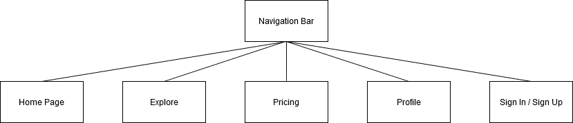

# Sitemap

## 1. Home Page

- **Trending Articles** (Top-performing blog posts)
- **Recently Published** (Chronologically latest posts)
- **Categories** (Blog categories like Travel, Lifestyle, Business)
- **Recommended for You** (Personalized based on reading history)
- **Community Highlights** (Popular writers, featured posts)

## 2. Explore (For Discovering Content)

- **Categories**
    - Examples: Travel, Lifestyle, Business, Food, DIY, Tech
- **Tags**
    - Examples: #SustainableLiving, #RemoteWork, #PlantBased, #DigitalMarketing
- **Top Writers** (Profiles of users with high engagement)
- **Popular Collections** (Curated collections by admin or community)
- **Search Bar** (Keyword search for blog posts and writers)
- **Trending Tags** (Popular hashtags or topics)

## 3. Pricing

- **Free Plan**  
  Get started with the basics:  
  - Access to a limited set of features  
  - Ability to publish posts and engage with the community  
  - Basic customization options  

- **Plus Plan**  
  Ideal for serious bloggers:  
  - Unlimited post publishing  
  - Advanced customization options  
  - Priority customer support  
  - Detailed analytics dashboard  
  - Monetization features (ads, affiliate links)  

- **Ultimate Plan**  
  Perfect for top-tier creators and businesses:  
  - Everything in the Plus Plan, plus:  
  - Enhanced visibility on the platform  
  - Advanced analytics and performance insights  
  - Collaborate with other top writers  
  - Custom branding options  
  - Exclusive networking opportunities  

## 4. Profile

- **My Blog** (Public-facing view of user’s blog and posts)
- **Analytics Dashboard** (For tracking views, likes, shares, and comments)
- **Personal Information**
    - Sections: Profile photo, bio, contact info (optional)
- **Settings**
    - **Subsections:**
        - **Privacy & Security** (Privacy settings, password management)
        - **Notifications** (Preferences for email, push notifications)
        - **Appearance Settings** (Themes, font choices, and layout for the personal blog)
- **Connected Accounts** (Social media, email subscriptions)

## ChatGPT prompts used

- "Develop an information architecture for the project based on the card sorting method"